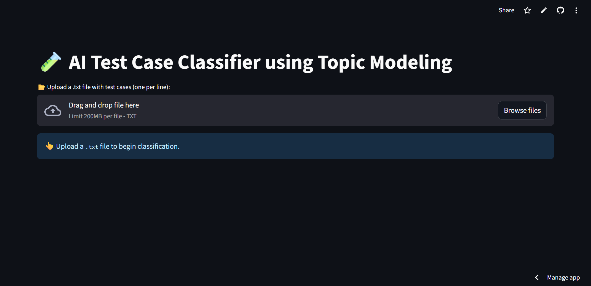
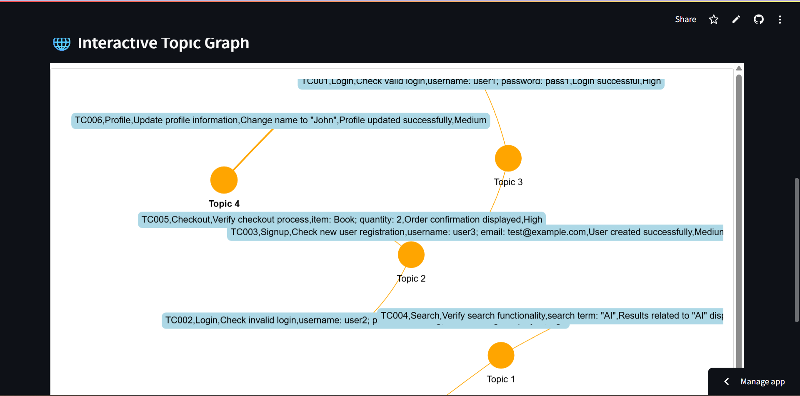
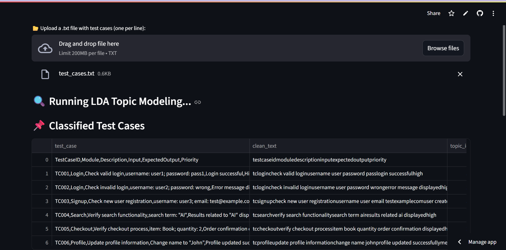

# AI Test Case Classifier using Topic Modeling

A Streamlit-based tool to classify industrial automation **test cases** using **LDA Topic Modeling**.  
The app allows users to upload test cases in CSV format, preprocesses text, applies NLP techniques, and displays **topic-labeled outputs** with **interactive graph visualization**.

---

## **Features**

- Upload test case `.csv` files
- Clean and preprocess text using NLP
- Apply **LDA topic modeling** using `scikit-learn`
- Interactive **topic graphs** using `PyVis`
- Streamlit-based user interface
- Visualize relationships between topics and test cases

---

## **Demo Screenshots**

### Home Page


### Graph Visualization


### Search Feature


---

## **Getting Started**

### **Installation**
```bash
git clone https://github.com/YourUsername/AI-Test-Case-Classifier.git
cd AI-Test-Case-Classifier
python -m venv .venv
source .venv/bin/activate  # Windows: .venv\Scripts\activate
pip install -r requirements.txt
